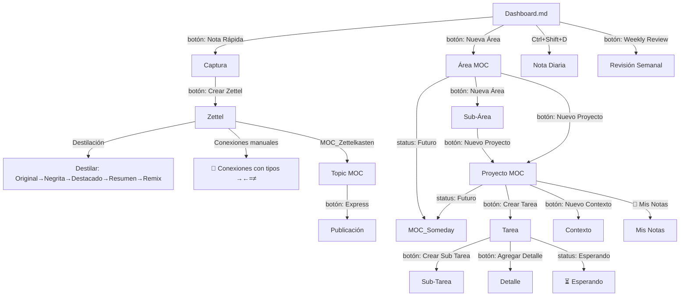

# 🛠️ Guía Práctica — Cómo Crear Notas

> Regla de oro: **nunca crees notas manualmente**. Siempre usá los botones desde el Dashboard, un Área, un Proyecto o el MOC_Zettelkasten. Las plantillas de `80_Templates` se encargan de los metadatos.

## 📐 Jerarquía del Sistema



---

## 📑 Secciones

- [[#1. Crear un Área]]
- [[#2. Crear una Sub-Área]]
- [[#3. Crear un Proyecto]]
- [[#4. Crear una Tarea]]
- [[#5. Crear una Sub-Tarea]]
- [[#6. Crear un Contexto]]
- [[#7. Crear un Detalle]]
- [[#8. Crear un Zettel (Nota de Conocimiento)]]
- [[#9. Crear un Topic MOC]]
- [[#10. Crear una Nota Diaria (Daily Note)]]
- [[#11. Crear una Weekly Review]]
- [[#12. Crear una Publicación (Express)]]
- [[#13. Destilar un Zettel (Destilación Progresiva)]]
- [[#14. Archivar una Nota]]
- [[#15. Marcar una Tarea como Esperando]]
- [[#16. Usar Ideas Futuras]]
- [[#17. Personalizar un MOC]]
- [[#18. El Sistema `origin` (Propiedad Más Importante)]]
- [[#📋 Resumen Rápido ¿Desde dónde creo cada cosa?]]

---

## 1. Crear un Área

Un área representa una responsabilidad a largo plazo (ej: Trabajo, Personal, Estudio).

**Pasos:**
1. Abrí el **Dashboard** (`Dashboard.md`)
2. Click en el botón **`➕ Nueva Área`**
3. Escribí el nombre del área (ej: `Trabajo`, `Personal`)
4. Se crea automáticamente en `25_Areas/MOC_[nombre].md`

**Resultado:**
- Tag: `#type/area`
- Propiedad `origin`: apunta al Dashboard
- Aparece automáticamente en el Dashboard
- Tiene secciones para: tareas Todoist, proyectos, sub-áreas y notas de inbox
- Callout `📝 Mis Notas` para que escribas tu contexto sobre el área
- Estado seleccionable: `Activo`, `Pausado`, `Futuro`, `Completado`, `Archivado`

## 2. Crear una Sub-Área

Una sub-área es un área que cuelga de otra, útil para dividir responsabilidades grandes.

**Pasos:**
1. Abrí el **Área padre** (ej: `25_Areas/MOC_Trabajo.md`)
2. Click en el botón **`➕ Nueva Área`** (mismo botón, pero desde dentro del área)
3. Escribí el nombre de la sub-área (ej: `Cliente X`, `Proyecto Interno`)

**Diferencia clave:** El `origin` apuntará al Área padre, **no** al Dashboard. Esto hace que la sub-área aparezca listada dentro del Área padre.

## 3. Crear un Proyecto

Un proyecto es un esfuerzo con fecha de finalización y resultado concreto.

**Pasos:**
1. Abrí el **Área** o **Sub-Área** donde vivirá el proyecto
2. Click en **`➕ Nuevo Proyecto`**
3. Escribí el nombre (ej: `Ecommerce`, `API de Analytics`)
4. Se crea en `20_Projects/MOC_[nombre].md`

**Resultado:**
- Tag: `#type/project`
- Panel de Control con estado, prioridad y deadline
- Planificación de tareas con secuencia y fechas
- Secciones para tareas agrupadas por estado (**Nuevo**, **Asignado**, **Esperando**, **Revisión**, **Pruebas**, **Resuelto**, **Cerrado**)
- Callout `📝 Mis Notas` para tu contexto del proyecto
- Estado seleccionable: `Activo`, `Pausado`, `Futuro`, `Completado`, `Archivado`

## 4. Crear una Tarea

**Pasos:**
1. Abrí el **Proyecto MOC** donde vive la tarea
2. Click en **`🛠️ Crear Tarea`**
3. Escribí el título de la tarea
4. Se crea en `20_Projects/[proyecto] - [título].md`

**La plantilla incluye:**
- Triángulo de estimación (Optimista / Esperada / Pesimista)
- Campo `waiting_for` para tareas bloqueadas (ver sección [[#15. Marcar una Tarea como Esperando]])
- Checklist de análisis
- Plan de Desarrollo (módulos y estimaciones)
- Bitácora de Ejecución con tracking de tiempo
- Resumen automático de horas con DataviewJS
- Panel de Control con prioridad y estado

**Estados disponibles:** `Nuevo`, `Asignado`, `Esperando`, `Revisión`, `Pruebas`, `Resuelto`, `Cerrado`, `Archivado`.

## 5. Crear una Sub-Tarea

**Pasos:**
1. Abrí la **Tarea** padre
2. Click en **`🛠️ Crear Sub Tarea`**
3. Escribí el título
4. Hereda automáticamente `origin` y `project` de la tarea padre

## 6. Crear un Contexto

Un contexto define el marco general de un proyecto (ej: `backend`, `frontend`, `devops`).

**Pasos:**
1. Abrí el **Proyecto MOC**
2. Click en **`➕ Nuevo Contexto`**
3. Escribí el nombre del contexto

## 7. Crear un Detalle

Para especificaciones técnicas o referencias dentro de una tarea.

**Pasos:**
1. Abrí la **Tarea**
2. Click en **`➕ Agregar Detalle`**
3. Escribí la descripción

## 8. Crear un Zettel (Nota de Conocimiento)

**Pasos:**
1. Desde **Capturas** o la **Library**, click en **`🧠 Crear Nota Zettel`**
2. Escribí el título de la idea atómica
3. El sistema te sugiere topics existentes o te deja crear uno nuevo
4. Se crea en `10_Library/[título].md`

**La plantilla incluye:**
- Panel de Control con estado (`Perenne`, `Desarrollo`, `Deprecado`)
- Selector de **Destilación** (`Original`, `Negrita`, `Destacado`, `Resumen`, `Remix`)
- **💎 Resumen Ejecutivo** (callout al inicio para la capa Resumen)
- **🔗 Conexiones** — sección donde escribís a mano enlaces a otros zettels con texto explicativo y prefijos de relación:
  - `→` desarrolla
  - `←` proviene de
  - `‌=` mismo concepto
  - `≠` contrasta
- **📎 Enlaces entrantes** — Dataview automático de notas que linkean a este zettel
- **📡 Enlaces automáticos (vía origin)** — notas creadas desde este zettel como contexto

**Regla Zettelkasten:** Una nota = una idea. Escribila con tus propias palabras.

## 9. Crear un Topic MOC

Un Topic MOC agrupa todos los zettels de un mismo tema.

**Pasos:**
1. Abrí **`MOC_Zettelkasten.md`** en `10_Library/`
2. La sección "Topics Sin MOC" muestra temas que aún no tienen MOC
3. Click en **`💡 Crear MOC`**
4. El sistema auto-detecta el topic basado en el contexto

**El template incluye:**
- Callout `📝 Mis Notas` para que describas el tópico
- Sección `📌 Enlaces Manuales` para links que vos elegís en orden significativo
- Lista automática Dataview como red de seguridad (todos los zettels con este topic)

## 10. Crear una Nota Diaria

**Pasos:**
1. Desde el **Dashboard**, click en **`📅 button-daily-note`**
2. También podés usar el atajo nativo: **`Ctrl+Shift+D`**
3. Se crea automáticamente en `30_Calendar/YYYY-MM-DD.md`

**La plantilla incluye:**
- **Capturas del día**: checklist de ideas/links rápidos
- **Pendientes**: tareas del día
- **Bitácora**: log de actividad con timestamps
- **Cierre del día**: logros, aprendido, mañana

**Importante:** Las daily notes **no** tienen `origin` (son independientes, no cuelgan de un padre). Aparecen listadas en el Dashboard.

## 11. Crear una Weekly Review

**Pasos:**
1. Desde el **Dashboard**, click en **`📋 button-weekly-review`**
2. También podés usar el atajo nativo: **`Ctrl+Shift+W`** (si está configurado)
3. Se crea en `30_Calendar/YYYY-[W]WW.md`

**La plantilla incluye:**
- Cálculo automático del lunes y domingo de la semana
- **Capturas**: procesar notas pendientes
- **Proyectos activos**: revisar estado de cada proyecto
- **Zettels**: qué se aprendió esta semana
- **Dailies**: enlace a las notas diarias de la semana
- **Logros**: qué se completó
- **Prioridades**: foco de la próxima semana

**Propiedades destacadas:**
- `week`: número de semana ISO (ej: `2026-W22`)
- `week_start`: fecha del lunes
- `week_end`: fecha del domingo

## 12. Crear una Publicación (Express)

Cuando un conjunto de zettels madura a una publicación (blog, docs, newsletter, tutorial):

**Pasos:**
1. Abrí **`MOC_Zettelkasten.md`**
2. Click en **`📝 button-create-express`**
3. Escribí el título de la publicación
4. Se crea en `10_Library/Express - [título].md`

**La plantilla incluye:**
- **TL;DR**: resumen ejecutivo de la publicación
- **Secciones de contenido** (estructura libre)
- **`source_zettels`**: lista de zettels fuente que inspiraron esta publicación
- **Checklist de publicación**: revisión antes de publicar
- **Panel de Control**: formato (`Artículo`, `Artículo Técnico`, `Documentación`, `Boletín`, `Tutorial`, `Nota Técnica`), estado (`Borrador`, `Revisión`, `Publicado`, `Archivado`), y `published_url`

## 13. Destilar un Zettel (Destilación Progresiva)

Aplicá las **5 capas de resumen progresivo** a medida que un zettel madura:

| Capa          | Acción                     | Cómo                                                               |
| ------------- | -------------------------- | ------------------------------------------------------------------ |
| 1️⃣ Original  | Nota recién creada         | Estado `Original` en el Panel de Control                           |
| 2️⃣ Bold      | Resaltar pasajes clave     | Seleccionar texto → **`Ctrl+B`**                                   |
| 3️⃣ Highlight | Destacar lo más importante | Seleccionar → ==`Ctrl+Shift+H`==                                   |
| 4️⃣ Resumen   | Escribir resumen ejecutivo | Completar el callout **💎 Resumen Ejecutivo** al inicio de la nota |
| 5️⃣ Remix     | Combinar con otros zettels | Referenciar en MOCs o publicaciones Express                        |

Actualizá el campo **Destilado** en el Panel de Control a medida que avanzas. En [[MOC_Zettelkasten]] hay secciones **"Para destilar"** y **"Destilados"** para dar seguimiento.

> 💡 **Tips mientras destilás:**
> - **Convertí conceptos en links**: cuando escribas el resumen (capa 4) o explores conexiones, si mencionás un concepto que ya existe como zettel, convertilo en `[[Zettel Relacionado]]`. No escribas el texto plano — que la palabra misma sea el enlace. Esto te da navegabilidad y hace que aparezcan en **📎 Enlaces entrantes** automáticamente.
> - **Relaciones manuales**: para relaciones más específicas, usá la sección `## 🔗 Conexiones` con los prefijos `→ ← = ≠`.

## 14. Archivar una Nota

Cuando un proyecto, área, tarea o nota ya no está activa:

**Pasos:**
1. Abrí su **Panel de Control**
2. Cambiá el **Estado** a **`Archivado`**
3. La nota **no se mueve** de ubicación — solo deja de aparecer en vistas activas

**Para ver items archivados:**
- [[MOC_Archive]] — lista central con todas las notas archivadas, agrupadas por tipo
- Dashboard → sección **🗃️ Archivo** — conteo agrupado con link al MOC

## 15. Marcar una Tarea como Esperando

Cuando una tarea está bloqueada porque estás esperando a alguien (revisor, cliente, otro equipo):

**Pasos:**
1. Abrí la **Tarea**
2. En el Panel de Control, cambiá **Estado Actual** a **`Esperando`**
3. Completá el campo **`waiting_for`** con la persona/equipo que estás esperando
4. Opcionalmente, agregá la fecha en **`waiting_since`** (si no se completa, usa la fecha de creación)

**Visualización:**
- En el **MOC del proyecto** → sección `⏳ Esperando` con tabla (nombre, esperando a, desde)
- En el **Dashboard** → sección `⏳ Esperando Respuesta` con todas las tareas en waiting cruzando proyectos

**Para reactivar:** cambiá el estado a `Asignado` y vaciá `waiting_for`.

## 16. Usar Ideas Futuras

Cuando el proyecto/área es una idea sin compromiso de ejecución hoy:

**Pasos:**
1. Abrí el **Proyecto MOC** o **Área MOC**
2. En el Panel de Control, cambiá **Estado** a **`Futuro`**
3. La nota deja de aparecer en vistas activas del área/Dashboard

**Para ver ideas futuras:**
- [[MOC_Someday]] — lista central con:
  - **Ideas Sueltas**: sección manual para anotar ideas que no ameritan proyecto
  - **Proyectos (Futuro)**: lista automática de proyectos con estado `Futuro`
  - **Áreas (Futuro)**: lista automática de áreas con estado `Futuro`
- Dashboard → sección **🔮 Ideas Futuras** — conteo agrupado con link al MOC

**Para activar una idea futura:** cambiá el estado a `Activo` y definí la próxima acción.

## 17. Personalizar un MOC

Los MOCs no son solo listas automáticas de Dataview. **El valor del MOC está en lo que vos agregás**: tus notas, tu contexto, tus enlaces elegidos a mano.

**En un MOC de Área o Proyecto:**
1. Abrí el MOC
2. Buscá el callout **`📝 Mis Notas`** (al inicio, después del Panel de Control)
3. Escribí contexto: ¿qué define esta área/proyecto? ¿qué decisiones importantes se tomaron? ¿qué notas de la Library son relevantes?

**En un MOC de Tópico (Topic MOC):**
1. Abrí el MOC
2. En **`📝 Mis Notas`**: explicá qué abarca el tópico, qué zettels son fundacionales, cómo se relacionan
3. En **`📌 Enlaces Manuales`**: agregá links que vos elegís en orden significativo, con una explicación breve entre cada uno

**Ejemplo de enlaces manuales:**
```markdown
> 1. [[Arquitectura Hexagonal]] — concepto fundacional
> 2. [[Patrón Puerto-Adaptador]] — implementación concreta
> 3. [[Comparativa Hexagonal vs MVC]] — contrasta ambos enfoques
```

La lista automática Dataview está al final del MOC como red de seguridad. Atrapa cualquier nota que tenga el `origin` apuntando a este MOC, así no se te pierda nada aunque te olvides de enlazarlo a mano. Pero la jerarquía visual es:

1. **📝 Mis Notas** — tu contexto y prioridades (lo más importante)
2. **📌 Enlaces Manuales** — conexiones curadas por vos con orden y explicación
3. **Lista automática Dataview** — respaldo automático (sin orden ni contexto, solo existe)

> ⚠️ No confíes solo en las listas automáticas. El valor real del MOC está en lo que escribís y enlazás vos. La lista automática es un seguro, no el plato principal.

## 18. El Sistema `origin` (Propiedad Más Importante)

Todas las notas tienen una propiedad `origin` en su YAML frontmatter. Esta propiedad:

- Apunta a la nota "padre" que la creó
- Hace que la nota aparezca automáticamente en los listados Dataview del padre
- Si está vacía, la nota queda **huérfana** y no se encuentra con los sistemas automáticos

**Cadena típica de `origin`:**
```
Dashboard → Área → Proyecto → Tarea → Sub-Tarea
```

Cada eslabón ve a sus "hijos" gracias a consultas Dataview como:
```
```dataview
LIST FROM "20_Projects" AND #type/task WHERE origin = this.file.link
```

**Excepciones:** Las **Daily Notes** y **Weekly Reviews** no tienen `origin` (son independientes, vía Periodic Notes).

---

## 📋 Resumen Rápido: ¿Desde dónde creo cada cosa?

| Quiero crear... | Voy a... | Uso el botón / atajo... |
|-----------------|----------|------------------------|
| Área | Dashboard | `➕ Nueva Área` |
| Sub-Área | Área padre | `➕ Nueva Área` |
| Proyecto | Área o Sub-Área | `➕ Nuevo Proyecto` |
| Tarea | Proyecto | `🛠️ Crear Tarea` |
| Sub-Tarea | Tarea | `🛠️ Crear Sub Tarea` |
| Contexto | Proyecto | `➕ Nuevo Contexto` |
| Detalle | Tarea | `➕ Agregar Detalle` |
| Zettel | Capturas / Library | `🧠 Crear Nota Zettel` |
| Topic MOC | MOC_Zettelkasten | `💡 Crear MOC` |
| Nota Rápida | Dashboard / Área | `📝 Nota Rápida` |
| Daily Note | Dashboard | `📅 button-daily-note` o `Ctrl+Shift+D` |
| Weekly Review | Dashboard | `📋 button-weekly-review` |
| Publicación (Express) | MOC_Zettelkasten | `📝 button-create-express` |
| Archivar | Cualquier nota | Cambiar estado a `Archivado` |
| Esperando | Tarea bloqueada | Cambiar estado a `Esperando` + completar `waiting_for` |
| Ideas Futuras | Proyecto/Área | Cambiar estado a `Futuro` |
| Personalizar MOC | Cualquier MOC | Escribir en `📝 Mis Notas` |
